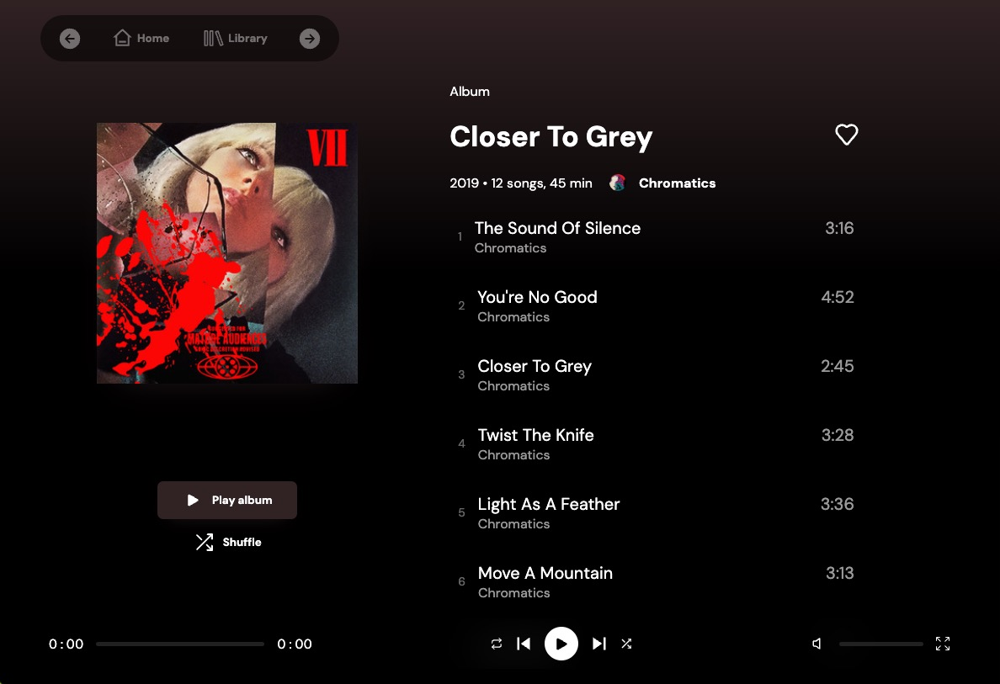
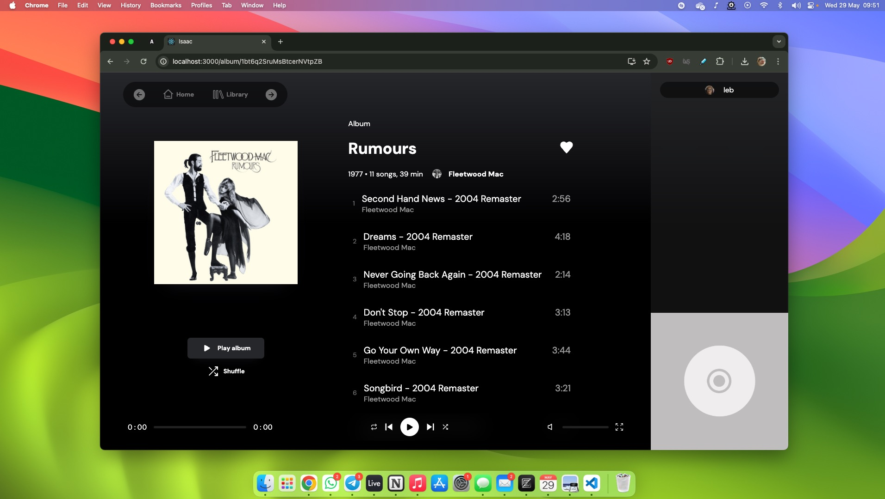
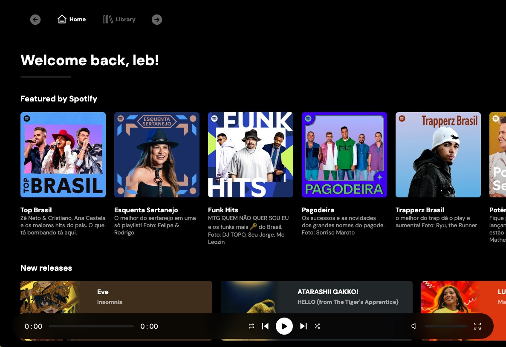

<h2>isaac</h2>

isaac is an open-source reimplementation of spotify's web client, built from scratch using react and typescript. this project aims to provide a clean and lightweight experience for spotify premium users with extra features.

<h3>notes</h3>
- setting this up will require also setting up [isaac's back end](https://github.com/caIebcodes/isaac-backend). 
- for now, the client's code is up but a lot of code is messy and needs refactoring, mostly the player. some functions are not implemented yet, such as artist and profile pages 
- playlist viewing and editing, liking songs, viewing your library, album pages and queue all work.
- this project is pretty much abandoned. its next steps would probably be to refactor the player's so it isn't dependent on spotify's web player sdk (by fetching song data blobs directly from their servers and decoding them instead) which is limited in quality and functionality, and reversing their private api to achieve feature parity with their official client. 
- this is up mostly for archiving reasons :)
